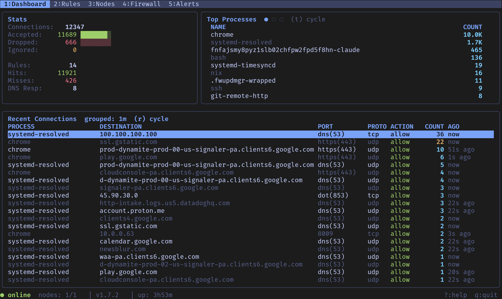
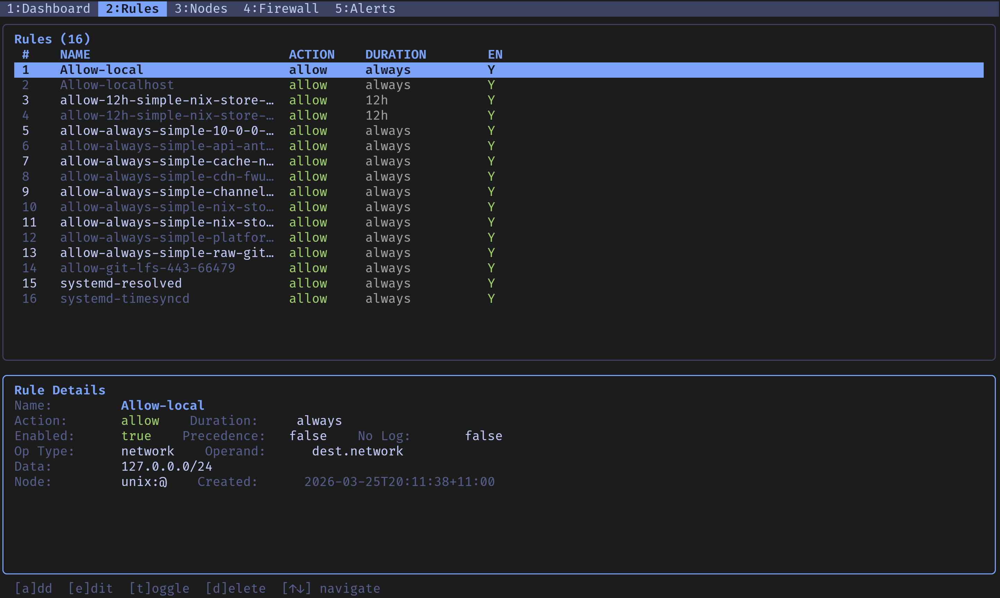
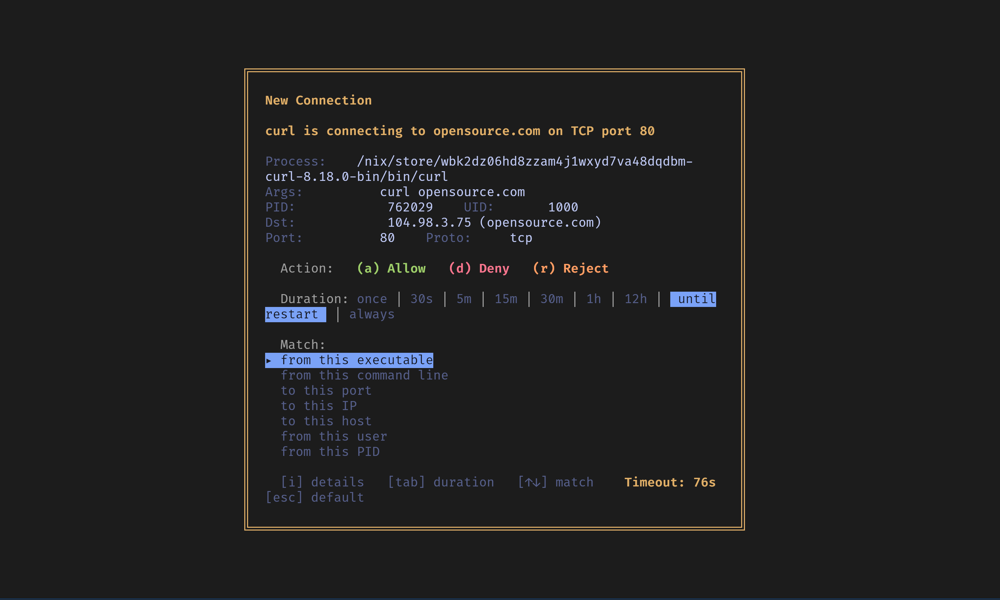

# ostui

A terminal UI for [OpenSnitch](https://github.com/evilsocket/opensnitch), the GNU/Linux application firewall. Replaces the default Python/Qt GUI with a keyboard-driven TUI built in Go.





## Features

**Dashboard** — live stats updated every second from the daemon. Connection and rule counters with proportional bars, a togglable top-N panel (processes, destinations, ports), and grouped recent connections with marquee scrolling for long names, relative timestamps, and service name resolution for common ports.

**Connection Prompt** — when the daemon intercepts an unknown connection, a modal overlay appears showing the process, destination, port, protocol, and user. Choose allow/deny/reject, pick a duration, and select what to match (executable, command line, destination, port, user, PID). 90 second timeout with countdown.

**Rules Management** — split view with a rule list and detail card. Add, edit, toggle, and delete rules. Inline editor with dropdown selectors for action, duration, operator type, and all 22 operands. Create rules directly from grouped connections on the dashboard. Renaming a rule properly deletes the old one.

**Node Management** — view connected daemons with status, version, rule count, and connection stats. Toggle interception on/off per node. Delete nodes (cascades to their rules and connections).

**Alerts** — color-coded alert log from the daemon (errors, warnings, kernel events) with type and priority indicators.

## How It Works

ostui implements the same gRPC server interface (`ui.proto`) as the official OpenSnitch GUI. The daemon (`opensnitchd`) connects to ostui exactly as it would to the Qt UI — no daemon modifications needed. Just point the daemon at ostui's socket and it works.

## Install

Requires Go 1.21+ and `protoc` with Go plugins.

```sh
# Build
make build

# Or directly
go build -o ostui .
```

To regenerate protobuf code (only needed if `ui.proto` changes):

```sh
make proto
```

## Usage

```sh
# Start with default socket (unix:///tmp/osui.sock)
./ostui

# Custom socket
./ostui --socket unix:///tmp/osui.sock

# All options
./ostui \
  --socket unix:///tmp/osui.sock \
  --db-file ~/.config/ostui/ostui.db \
  --default-action deny \
  --default-duration "until restart" \
  --default-timeout 90 \
  --group-window 60
```

Make sure `opensnitchd` is configured to connect to the same socket address.

### Flags

| Flag | Default | Description |
|---|---|---|
| `--socket` | `unix:///tmp/osui.sock` | gRPC socket address |
| `--db-file` | `~/.config/ostui/ostui.db` | SQLite database path |
| `--default-action` | `deny` | Action when prompt times out |
| `--default-duration` | `until restart` | Default rule duration |
| `--default-timeout` | `90` | Prompt timeout in seconds |
| `--group-window` | `60` | Seconds to group recent connections |
| `--log-file` | `~/.config/ostui/ostui.log` | Log file path |
| `--max-msg-length` | `4194304` | gRPC max message size |

## Key Bindings

### Global

| Key | Action |
|---|---|
| `1`-`5` | Switch tab (Dashboard, Rules, Nodes, Firewall, Alerts) |
| `?` | Help overlay |
| `q` | Quit |

### Dashboard

| Key | Action |
|---|---|
| `j`/`k` | Navigate grouped connections |
| `t` | Cycle top-N panel (Processes / Destinations / Ports) |
| `r` | Cycle group window (1m / 5m / 60m) |
| `a` / `Enter` | Create rule from selected connection |

### Rules

| Key | Action |
|---|---|
| `j`/`k` | Navigate rules |
| `a` | Add new rule |
| `e` / `Enter` | Edit selected rule |
| `t` | Toggle enable/disable |
| `d` | Delete (with confirmation) |

### Rule Editor

| Key | Action |
|---|---|
| `Tab` / `Shift+Tab` | Next / previous field |
| `Left` / `Right` | Change dropdown value |
| `Space` | Toggle boolean field |
| `Ctrl+S` | Save |
| `Esc` | Cancel |

### Connection Prompt

| Key | Action |
|---|---|
| `a` | Allow |
| `d` | Deny |
| `r` | Reject |
| `Tab` / `Shift+Tab` | Cycle duration |
| `Up` / `Down` | Cycle match target |
| `i` | Toggle details |
| `Esc` | Apply default action |

### Nodes

| Key | Action |
|---|---|
| `j`/`k` | Navigate nodes |
| `i` | Toggle interception |
| `d` | Delete node (with confirmation) |

## Logging

All errors and events are logged to `~/.config/ostui/ostui.log`. Tail it for debugging:

```sh
tail -f ~/.config/ostui/ostui.log
```

## Database

ostui uses SQLite with a schema compatible with the official OpenSnitch GUI. Connection history persists across restarts and is loaded on startup. The database is stored at `~/.config/ostui/ostui.db` by default.

## License

GPL-3.0 — see [LICENSE](LICENSE).
